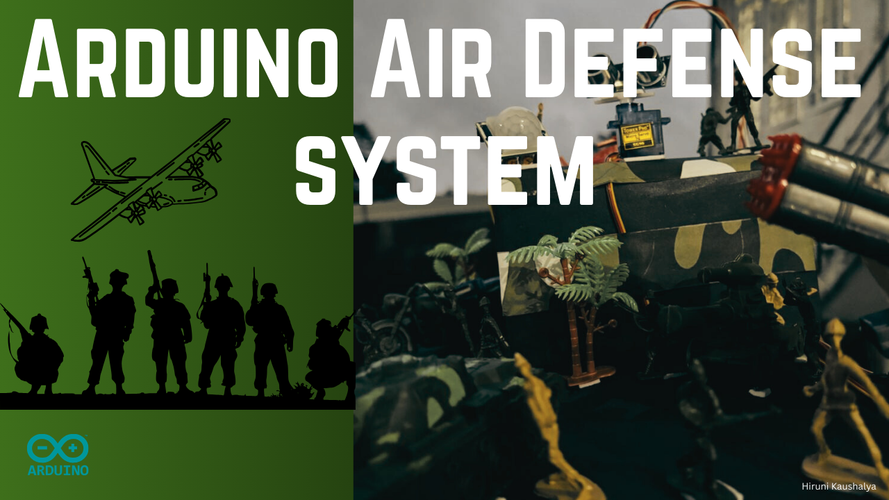
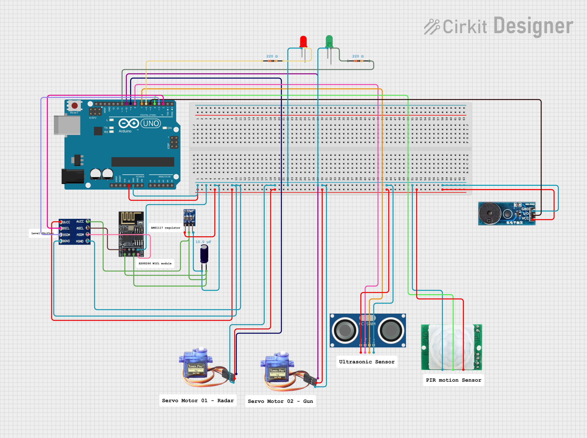

# ✈ Arduino Air Defense System


---

## 📌 Project Purpose
This project is developed as part of **ICT 3123 - Internet of Things** Continuous Assessment.  
It demonstrates an **IoT-enabled air defense system** using Arduino that integrates multiple sensors and actuators to detect motion, measure distance, and trigger responses.

The system simulates a mini air defense system where:
- A **PIR sensor** detects motion.
- An **ultrasonic sensor** measures object distance.
- A **servo motor (gun)** adjusts its angle according to detected distance.
- A **radar servo** sweeps continuously to scan the environment.
- **LED indicators** and a **buzzer** alert when a threat is detected.
- A **Processing visualization** displays a live radar screen with detected objects.

---

## ⚙️ Hardware Components
- Arduino Uno (or compatible)
- PIR Motion Sensor
- Ultrasonic Sensor (HC-SR04)
- 2 × Servo Motors (Radar + Gun)
- Red LED & Blue LED
- Buzzer
- Jumper Wires
- Breadboard
- ESP8266 / Ethernet Shield (for IoT connectivity, optional)

---

## 🖥️ Software Requirements
- Arduino IDE (latest version)
- Processing IDE (for radar visualization)
- Cirkit Designer IDE (for circuit diagram)
- GitHub (for version control)

---

## 🚀 Setup Guide

### 1. Clone Repository
```bash
git clone https://github.com/your-username/arduino-air-defense-system.git
cd arduino-air-defense-system
```

### 2. Arduino Setup
1. Open the .ino file in Arduino IDE.
2. Connect your Arduino Uno to the computer.
3. Upload the code to the board.

### 3. Processing Setup
1. Open the radar.pde file in Processing IDE.
2. Make sure the serial port in the code matches your Arduino port.
3. Run the sketch to see the radar visualization.

### 4. Circuit Wiring
Refer this circuit diagram and use this link to create circuit diagrams. 
```bash 
https://app.cirkitdesigner.com/
```

---

## 📡 System Workflow
1. Radar Servo continuously sweeps from 0° to 180°.
2. Ultrasonic Sensor measures distance of objects in the sweep path.
3. PIR Sensor checks for motion presence.
4. If both motion is detected and object is within 20 cm:
   - Red LED + Buzzer → Threat Alert
   - Gun Servo → rotates toward object
5. Otherwise:
   - Blue LED ON → Safe state
   - Gun Servo → reset to neutral position
6. Data is sent to Processing IDE for live radar visualization.

---

## 📊 System Architecture
- Input: PIR sensor + Ultrasonic sensor
- Processing: Arduino Uno (Edge computing with decision-making logic)
- Output: Servo motors, LEDs, Buzzer, Processing Visualization
